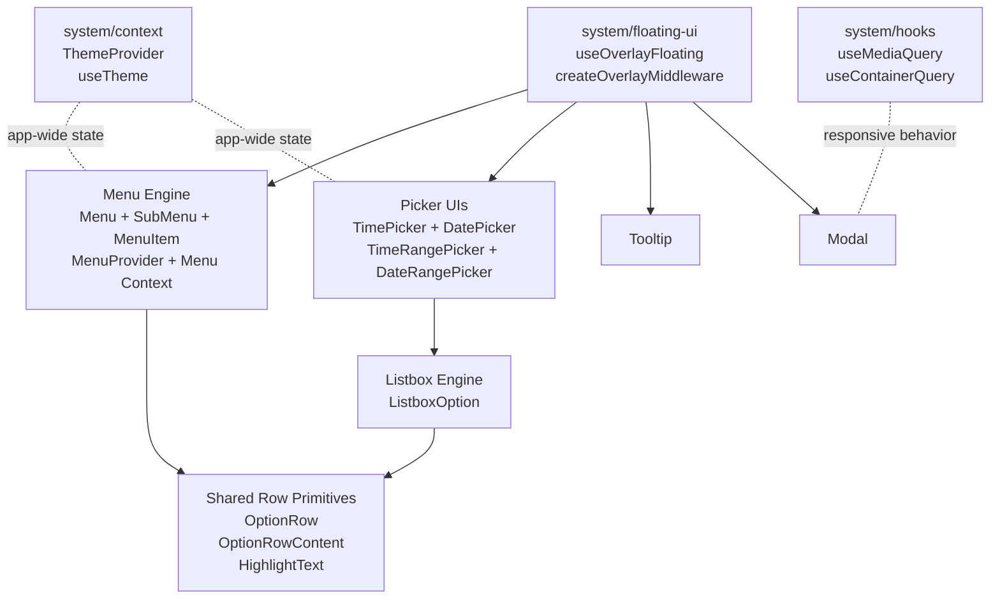

# Floating UI Architecture and Composition Guide

This document explains the new shared architecture for floating components,
how each piece works, and how to compose product use-cases from the same
building blocks.

## Why This Exists

The design system had repeated floating logic across Menu, DatePicker,
TimePicker, Tooltip, and Modal. The new model keeps interaction semantics
correct per pattern while sharing floating primitives.

Goals:

- Keep component behavior accessible and pattern-correct.
- Reuse Floating UI wiring and middleware defaults.
- Provide predictable, composable primitives for future components.

## Architecture Diagram



## New Pieces and Responsibilities

### `src/system/floating-ui/floating.ts`

- `useOverlayFloating(options)`: shared wrapper around `useFloating`.
- `createOverlayMiddleware(options)`: baseline middleware builder with
  `offset`, `flip`, `shift`, plus extensible extras.
- Use this for all anchored floating components by default.

### `src/system/context/`

- `ThemeContext.tsx`: `ThemeProvider` implementation and theme DOM sync.
- `theme-context.ts`: context object + shared types.
- `useTheme.ts`: hook API for theme consumers.
- `index.ts`: public barrel for `ThemeProvider` and `useTheme`.

### `src/system/hooks/`

- `mq.hook.ts`: token-aware media query hook.
- `cq.hook.ts`: token-aware container query hook.
- `index.ts`: public barrel exports.

### `src/components/Menu/context/menuContext.ts`

- Component-local context layer for Menu compound components.
- Owns Menu filter model, list model, root interaction model, and helper
  utilities for match/highlight and component-type detection.

### `src/components/Menu/MenuProvider.tsx`

- Explicit opt-in provider for menu compounds when consumers need context
  without mounting full `<Menu />`.
- Intended for advanced/integration scenarios.

### `src/components/OptionRow/OptionRow.tsx`

- Neutral option row primitive with listbox option semantics.
- Uses dedicated recipe (`optionRow`) and supports selected state.

### `src/components/OptionRow/OptionRowContent.tsx`

- Shared item-content composition layer:
  - label + description
  - leading/trailing icons
  - optional checkbox/toggle control rendering
  - optional query highlighting integration

### `src/components/OptionRow/HighlightText.tsx`

- Reusable query-highlighting renderer for label/description text.

### `src/components/ListboxOption/ListboxOption.tsx`

- Listbox-oriented option component built from `OptionRow` and
  `OptionRowContent`.
- Keeps listbox semantics isolated from menu semantics.

## Semantics Boundaries

Share mechanics, not semantics:

- Menu semantics stay in Menu engine (`menuitem`, close-on-select behavior,
  tree events, submenu navigation).
- Listbox semantics stay in listbox components (`role="option"`, selection
  state managed as value options).
- Calendar/date grid semantics stay in calendar engine (`grid` pattern).
- Tooltip and Modal keep their specific focus and ARIA behavior.

## Use-Cases from Product Surface (Image Mapping)

The image shows these use-cases. Here is how each is composed from the new
architecture.

### 1) Actions

- Composition: `Menu` + `MenuItem`
- Shared internals: `useOverlayFloating` + menu context
- Semantics: action menu

### 2) Single-select

- Composition: listbox trigger + listbox panel + `ListboxOption`
- Shared internals: `useOverlayFloating` + `OptionRow`/`OptionRowContent`
- Semantics: listbox/select

### 3) SubMenu fly-out style

- Composition: `Menu` + nested `SubMenu` + `MenuItem`
- Shared internals: `useOverlayFloating` + menu tree/list context
- Semantics: nested action menu

### 4) SubMenu dig-in style

- Composition: `Menu` with `subMenuInteraction="digin"` + `SubMenu`
- Shared internals: same Menu engine with dig-in level stack
- Semantics: hierarchical action navigation

### 5) Autocomplete

- Composition: input + filtered listbox panel + `ListboxOption`
- Shared internals: `useOverlayFloating` + `OptionRowContent` highlighting
- Semantics: combobox/listbox

### 6) Multi-select

- Composition: listbox + `ListboxOption` with
  `selectionControl="checkbox"`
- Shared internals: `OptionRowContent` control rendering
- Semantics: multi-select listbox

### 7) Date pickers

- Composition: `DatePicker` + `Calendar`
- Shared internals: `useOverlayFloating`
- Semantics: date grid picker

### 8) Time pickers

- Composition: `TimePicker` + time columns using `ListboxOption`
- Shared internals: `useOverlayFloating` + `OptionRow` stack
- Semantics: segmented input + option list selection

### 9) Date + Time pickers

- Composition: `DatePicker` + `TimePicker` or a combined wrapper surface
- Shared internals: same floating primitives and listbox row primitives
- Semantics: composed date/time selection flow

### 10) Arbitrary functionality panels

- Composition: Menu panel or Modal/Popover + custom content blocks
- Shared internals: `useOverlayFloating` and context scaffolding as needed
- Semantics: depends on content intent (action menu, dialog, or nav panel)

## Construction Examples

### Listbox Option with Description and Toggle

```tsx
<ListboxOption
  label="Clock in/out"
  description="Track work session"
  selected={isEnabled}
  selectionControl="toggle"
  onClick={toggleItem}
/>
```

### Menu Item Using Shared Content Layer (internal engine)

```tsx
<MenuItem label="Export" description="Download as CSV" iconBefore="download" />
```

## File Map (Current)

- Floating UI core: `src/system/floating-ui/floating.ts`
- Global context layer: `src/system/context/`
- Global hook layer: `src/system/hooks/`
- Menu context layer: `src/components/Menu/context/menuContext.ts`
- Shared row primitives: `src/components/OptionRow/`
- Listbox option: `src/components/ListboxOption/`

## Contributor Notes

- New floating components should start from `useOverlayFloating`.
- New option-like rows should prefer `OptionRow` + `OptionRowContent`.
- Keep pattern semantics separate even when visuals are shared.
- If you need new shared behavior across 2+ component families, place it in
  `src/system/` rather than inside a single component folder.
